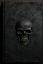
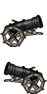
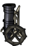
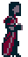
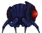
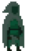
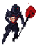
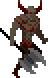

# О проекте
Двумерный платформер. Нажав на изображение ниже, Вы можете посмотреть видео, записанное на одной из версий. 

## Управление
* _A_ — движение налево
* _D_ — движение направо
* _W_ — прыжок
* _1_, _2_... — черные книги
* _Пробел_ / _Enter_ — переход на следующую главу / возрождение
## Черные книги
* _Наблюдающие сферы_. Протагонист невидим в течение _5_ секунд. 

* _Покинутые жизни_. Протагонист убивает врагов при касании в течение _5_ секунд. 

## Орудия
* _Пушка_. Обладает небольшой слепой зоной и дальностью, стреляет под углом _30_ градусов. Пушка, как и другие орудия, может потерять игрока из виду, если тот использует черную книгу «_Наблюдающие сферы_». 

* _Мортира_. Обладает большой слепой зоной и дальностью. Стреляет очередями по три ядра под углом, приблизительно равным _90_ градусам. 

## Враги
* _Вампирша_. Перемещается немного быстрее игрока, патрулируя область. Вампирша, как и остальные враги, уязвима для атак сверху и для атак, совершенных под действием черной книги «_Покинутые жизни_». 

* _Подчиненный паук_. Перемещается значительно быстрее игрока, патрулируя область. Нужно много времени, чтобы разогнаться. 

* _Подчиненная душа_. Перемещается немного медленее игрока, патрулируя область. Невидим, пока протагонист находится на расстоянии. 

* _Старый вампир_. Перемещается немного медленнее игрока, патрулируя область. Создает вокруг себя кровавый шар, который уничтожает протагониста при приближении, делая владельца неуязвимым, пока существует. 

* _Лорд_. ??? 

## Зависимости
* SFML
## Упоминания
* [Шрифт](https://www.fontfabric.com/fonts/baron/) от _Frank Hemmekam_
* Иллюстрации от [_Midjounrey_](https://www.midjourney.com/)
* [Рыцарь](https://free-game-assets.itch.io/free-fantasy-knight?download) от _craftpix_
* [Основной набор плиток](https://vnitti.itch.io/taiga-asset-pack) от _vnitti_
* [Пушка](https://opengameart.org/content/basic-cannon-hd) от _Spring_
* [Лесной фон](https://edermunizz.itch.io/free-pixel-art-forest) от _Eder Muniz_
* [Огненный шар](https://opengameart.org/content/firebal-32x32) от _MSavioti_
* [Фоновая музыка](https://void1gaming.itch.io/free-horror-music-pack) от  _VOID1_
* [Вампирша](https://opengameart.org/content/vampire-huntress-animated-pixel-character) от _Imogia Games_
* [Паук](https://ismartal.itch.io/2d-animated-monster-character-laser-flea) от _Ismartal_
* [Призрак](https://opengameart.org/content/ghost-1) от _Calciumtrice_
* [Старый вампир](https://creativekind.itch.io/necromancer-free) от _creativekind_
* [Лорд](https://sanctumpixel.itch.io/imp-axe-demon-pixel-art-character) от _sanctumpixel_