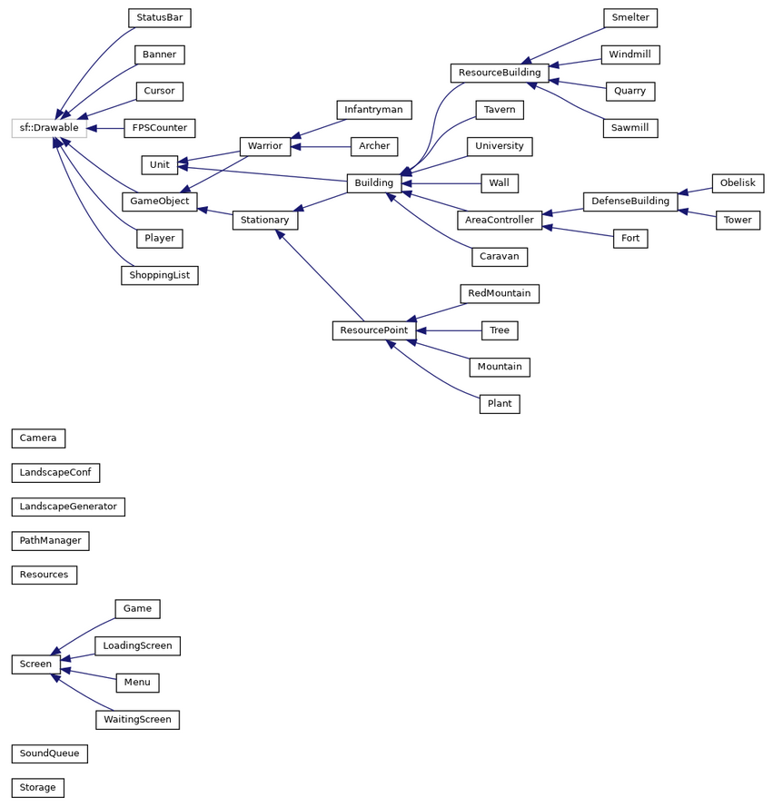

# Darklands

2D RTS.
[Видео с игровым процессом на Youtube (может отличаться от последней версии)](https://youtu.be/xklnQPFrjQ4) 

## Предупреждение

Проект находится в разработке!

## Зависимости

* **SFML System**
* **SFML Window**
* **SFML Graphics**
* **SFML Audio**

## Документация

### Структура наследования (может отличаться от последней версии)

## Заимствованные материалы

* [Шрифт от **Sol Matas**](https://fonts-online.ru/fonts/bitter-pro)
* [Изображения некоторых зданий и гор от **Nicu**](http://clipart.nicubunu.ro/?gallery=rpg_map)
* [Фоновая музыка, изображение лесопилки и изображение курсора из проекта **Widelands**](https://github.com/widelands/widelands)
* [Иконка молота от **laxattack1226**](https://opengameart.org/content/heavy-iron-hammer)
* [Иконка воина от **andrwood**](https://andrwood.itch.io/warrior)
* [Изображения растений от **Maaot**](https://maaot.itch.io/mossy-cavern)
* [Изображения людей из библиотеки **Reiner's Tilesets**](https://www.reinerstilesets.de/)
* [Изображение знамени от **Danimal**](https://opengameart.org/content/war-banner)
* [Иконка лесопилки от **RalmonM**](https://opengameart.org/content/woodcutter-cabin-2)
* [Некоторые иконки от **saint11**](https://opengameart.org/content/resouces-pack-1)
* [Обелиск из **Battle for Wesnoth**](https://github.com/wesnoth/wesnoth)
